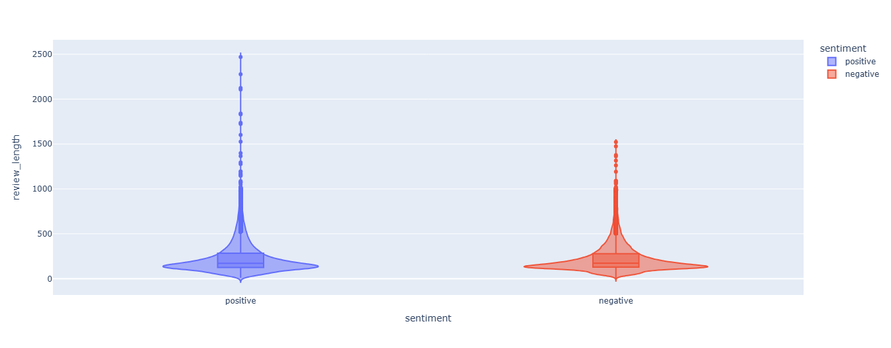

# IMDb Movie Reviews Sentiment Classification

## 1. Назва проєкту та короткий опис

Проєкт присвячений задачі бінарної класифікації текстових відгуків про фільми.

Мета проєкту — побудувати модель, яка автоматично визначає тональність відгуку користувача:
- `positive` — позитивний відгук;
- `negative` — негативний відгук.

У рамках проєкту проведено порівняння класичних моделей машинного навчання на основі TF-IDF представлення тексту та Transformer-моделі DistilBERT.

---

## 2. Бізнес-задача та мета

Автоматичний аналіз тональності текстів може використовуватися для:

- моніторингу думки користувачів;
- аналізу великої кількості відгуків без ручної обробки;
- оцінки рівня задоволеності клієнтів;
- підтримки прийняття рішень на основі текстових даних.

Мета проєкту — дослідити різні підходи до задачі sentiment analysis та визначити найбільш ефективну модель для класифікації текстових відгуків.

---

## 3. Дані

У проєкті використано датасет **IMDb Movie Reviews**.

Джерело:

[IMDb Dataset of 50K Movie Reviews](https://www.kaggle.com/datasets/lakshmi25npathi/imdb-dataset-of-50k-movie-reviews)

Опис датасету:

- кількість відгуків: **50 000**;
- задача: бінарна класифікація текстів;
- класи:
  - `positive`;
  - `negative`.

Під час EDA було проведено аналіз розподілу класів, довжини текстів та найбільш важливих слів.


Також було виявлено дублікати відгуків. Вони були видалені для запобігання **data leakage** між тренувальною та валідаційною вибірками та отримання більш об'єктивної оцінки якості моделей.

---

## 4. Підхід до оцінювання

Для оцінки моделей використовувалися наступні метрики:

- **Accuracy**;
- **F1-score**;
- **ROC-AUC**.

Основною метрикою було обрано **F1-score**, оскільки вона враховує баланс між precision та recall і є більш інформативною для задачі класифікації текстів.

Моделі оцінювалися на:
- training dataset;
- validation dataset;
- test dataset (для фінальних моделей).

---

## 5. Підхід до розв'язку та інструменти

### Попередня обробка тексту

Для підготовки текстових даних виконувалися:

- приведення тексту до нижнього регістру;
- видалення HTML-тегів;
- видалення пунктуації;
- токенізація;
- видалення stop words;
- POS-tagging;
- лематизація.

### Класичні ML-моделі

Було побудовано та порівняно наступні моделі:

- Logistic Regression;
- Decision Tree;
- Linear SVM;
- XGBoost.

Для представлення тексту використовувався:

- TF-IDF Vectorization.

Для оптимізації гіперпараметрів використовувався:

- GridSearchCV.

### Аналіз важливості ознак

Для інтерпретації роботи моделі було проведено аналіз важливості ознак для **Logistic Regression з оптимізованими параметрами моделі та TF-IDF векторизації**.

Аналіз виконувався на основі коефіцієнтів моделі, де додатні значення вказують на більший внесок ознаки у прогноз позитивного класу, а від'ємні — у прогноз негативного класу.

Найбільш важливими позитивними ознаками стали слова з вираженим позитивним забарвленням, такі як `great`, `excellent`, `perfect`, `wonderful`, `love` та `amazing`.

Серед найбільш впливових негативних ознак були слова `bad`, `awful`, `waste`, `terrible`, `worst` та `boring`.

Також серед топ-20 важливих ознак були присутні слова з менш очевидним емоційним значенням, наприклад `today` та `subtle` для позитивного класу, а також `suppose` для негативного класу. Це демонструє, що модель використовує не тільки явні емоційні слова, а й статистичні закономірності у текстових даних.

### Deep Learning модель

Також була використана Transformer-модель:

- **DistilBERT** для задачі sequence classification.

Модель була донавчена (**fine-tuning**) на датасеті IMDb Movie Reviews.


## 6. Результати

Порівняння моделей:

| Model | Key hyperparameters | Train F1-score | Validation F1-score | Test F1-score | Training time |
|---|---|---:|---:|---:|---:|
| Logistic Regression (Baseline) | max_iter=1000 | 0.9295 | 0.8979 | - | 1 s |
| Decision Tree | max_depth=10, min_samples_leaf=5 | 0.7850 | 0.7675 | - | 9 s |
| XGBoost | n_estimators=1000, learning_rate=0.05, max_depth=6 | 0.9622 | 0.8759 | - | 17 min |
| Linear SVM | C=0.1, class_weight=balanced | 0.9337 | 0.8994 | - | 23 s |
| Logistic Regression + TF-IDF tuning | C=2, class_weight=balanced, tuned TF-IDF | 0.9481 | 0.9019 | 0.8969 | 23 s |
| DistilBERT | Transformer fine-tuning | 0.9733 | 0.9124 | 0.9066 | 18 min |

---

## 7. Висновки

У результаті експериментів було проведено порівняння класичних моделей машинного навчання та Transformer-підходу для задачі sentiment analysis.

Серед класичних моделей найкращий результат показала **Logistic Regression з оптимізованими параметрами TF-IDF**, яка досягла:

- Validation F1-score: **0.9019**
- Test F1-score: **0.8969**

Найкращу якість класифікації продемонструвала модель **DistilBERT**:

- Validation F1-score: **0.9124**
- Test F1-score: **0.9066**

Перевага DistilBERT пояснюється здатністю Transformer-моделей враховувати контекст слів та складні залежності у тексті.

Водночас TF-IDF + Logistic Regression залишається ефективним рішенням, яке забезпечує високу якість при значно меншому часі навчання.

Видалення дублікатів з датасету дозволило уникнути data leakage та отримати більш реалістичну оцінку якості моделей.

---

## 8. Як запустити проєкт (Installation & Usage)

Клонувати репозиторій:

```bash
git clone <repository_url>
cd IMDb-Sentiment-Classification
```

Встановити залежності:

```bash
pip install -r requirements.txt
```
### Дані

Через обмеження на розмір файлів датасети не включено до репозиторію.

Для відтворення результатів необхідно:

1. Завантажити датасет IMDb Movie Reviews за посиланням: https://www.kaggle.com/datasets/lakshmi25npathi/imdb-dataset-of-50k-movie-reviews
2. Помістити файл `IMDB Dataset.csv.zip` у папку `data/`.
3. Запустити ноутбуки у наведеному порядку.

### Модель DistilBERT

Через обмеження на розмір файлів навчена модель **DistilBERT** (понад 250 МБ) не включена до репозиторію.

Для її використання можна:

- відтворити навчання, виконавши відповідний Jupyter Notebook;
- або завантажити готову модель за посиланням на Google Drive:

**Google Drive:**: https://drive.google.com/drive/folders/1SR9u7T82tNjq8gqPFHdaHJYGDuAc4nJz?usp=drive_link

Для відтворення експериментів необхідно запускати Jupyter Notebook у наступному порядку:

```
notebooks/

├── 01_eda.ipynb
└── 02_models.ipynb
```

Збережені моделі та інші артефакти знаходяться у директорії:

```
models/
```

---

## 9. Вимоги (requirements.txt)

Усі необхідні залежності для запуску проєкту наведені у файлі:

```
requirements.txt
```

Основні бібліотеки:

- pandas;
- numpy;
- scikit-learn;
- xgboost;
- nltk;
- pytorch;
- transformers;
- datasets.

---
